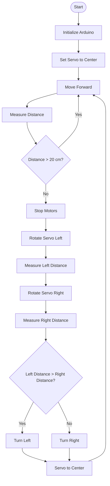

# 🚗 4-Motor Autonomous Obstacle-Avoiding RC Car

An autonomous **4-wheel obstacle-avoiding robotic car** developed using an **Arduino Uno**, **HW-130/L298 motor driver**, **HC-SR04 ultrasonic sensor**, and **SG90 servo motor**.

The robot is designed to move forward automatically and detect obstacles in its path. When an obstacle is detected within approximately **20 cm**, the robot stops, rotates the ultrasonic sensor toward the left and right directions using the servo motor, measures the available distance on both sides, and automatically turns toward the side with more available space.

This project demonstrates practical concepts of **embedded systems, robotics, sensor interfacing, motor control, autonomous navigation, and Arduino programming**.

---

## 👥 Group Members

| Name | Registration No. |
|---|---|
| Abdul Wahab Khan | 22-CE-013 |
| Muhammad Reyan | 22-CE-003 |

---

## 📌 Project Overview

The main purpose of this project is to develop a simple autonomous robotic vehicle capable of navigating around obstacles without requiring manual control.

The robot continuously monitors the area in front of it using an **HC-SR04 ultrasonic sensor**. The ultrasonic sensor is mounted on an **SG90 servo motor**, allowing it to look toward different directions.

When the path is clear, all four motors move the robot forward. When an obstacle is detected at approximately 20 cm or less, the robot stops and performs a scanning process.

The robot scans both the left and right sides, compares the measured distances, and chooses the direction that provides more available space.

### Main Features

- 🤖 Autonomous movement
- 🚗 Four-wheel drive
- 📡 Ultrasonic obstacle detection
- 🔄 Servo-based left/right scanning
- 🛑 Automatic stopping
- ↩️ Automatic left/right turning
- 🔋 Battery-powered operation
- 🎛️ Arduino-based control
- 🚫 No Bluetooth required

---

# 🎯 Objectives

The main objectives of this project are:

1. To design and develop an autonomous 4-wheel robotic car.
2. To control four DC motors using a motor driver.
3. To detect obstacles using an HC-SR04 ultrasonic sensor.
4. To automatically stop the robot when an obstacle is detected.
5. To use an SG90 servo motor for left and right scanning.
6. To compare the available distance on both sides.
7. To automatically select a suitable direction.
8. To demonstrate autonomous navigation using Arduino.
9. To understand practical interfacing between sensors, actuators, and microcontrollers.
10. To develop a simple and low-cost robotics project for educational purposes.

---

# 🛠️ Hardware Components

The following hardware components are used in this project:

- **Arduino Uno**
- **HW-130 / L298 Motor Driver**
- **4 × DC Gear Motors**
- **4 × Wheels**
- **HC-SR04 Ultrasonic Sensor**
- **SG90 Servo Motor**
- **Robot Car Chassis**
- **Battery**
- **Jumper Wires**

---

# 💻 Software Requirements

The project requires:

- **Arduino IDE**
- **Arduino C/C++**
- **Servo Library**

No Bluetooth library is required because the current version of the project operates completely autonomously.

---

# 🧩 System Architecture

The overall system can be represented as follows:

```text
                         ┌────────────────────┐
                         │    Arduino Uno     │
                         │   Main Controller  │
                         └─────────┬──────────┘
                                   │
                  ┌────────────────┼────────────────┐
                  │                │                │
                  ▼                ▼                ▼
          ┌──────────────┐ ┌──────────────┐ ┌──────────────┐
          │ HC-SR04      │ │ SG90 Servo   │ │ Motor Driver │
          │ Ultrasonic   │ │              │ │ HW-130/L298  │
          │ Sensor       │ │ Sensor Scan  │ │              │
          └──────────────┘ └──────────────┘ └──────┬───────┘
                                                   │
                                    ┌──────────────┴──────────────┐
                                    │                             │
                                    ▼                             ▼
                              Left Motors                  Right Motors
                              Front + Rear                 Front + Rear
````

---

# ⚙️ Working Principle

The robot follows an automatic obstacle-avoidance process.

### Step 1 — Start

When the robot is powered on, the Arduino initializes the motor driver, ultrasonic sensor, and servo motor.

The servo moves the ultrasonic sensor to the center position.

### Step 2 — Move Forward

The robot starts moving forward.

Both motor-driver channels are activated so that all four wheels move together.

### Step 3 — Measure Distance

The HC-SR04 ultrasonic sensor continuously measures the distance between the robot and objects in front of it.

### Step 4 — Check for Obstacle

The Arduino compares the measured distance with the obstacle threshold.

The threshold used in this project is approximately:

```text
20 cm
```

If the distance is greater than 20 cm:

```text
Continue Forward
```

If the distance is 20 cm or less:

```text
Stop Motors
```

### Step 5 — Scan Left

After stopping, the servo rotates the ultrasonic sensor toward approximately **30°**.

The Arduino measures the distance available on the left side.

### Step 6 — Scan Right

The servo then rotates toward approximately **150°**.

The Arduino measures the distance available on the right side.

### Step 7 — Compare Distances

The Arduino compares the left and right measurements.

```text
If Left Distance > Right Distance
        ↓
    Turn Left

Otherwise
        ↓
    Turn Right
```

### Step 8 — Continue Forward

After completing the turn, the robot returns to forward movement and continues checking for obstacles.

---

# 🔄 Project Flowchart



---

# 🔌 Pin Configuration

## Motor Driver Connections

| Arduino Uno | HW-130 / L298 |
| ----------- | ------------- |
| D5          | ENA           |
| D4          | IN1           |
| D7          | IN2           |
| D6          | ENB           |
| D8          | IN3           |
| D12         | IN4           |

### Motor Outputs

```text
OUT1 + OUT2
     ↓
Front Left Motor + Rear Left Motor

OUT3 + OUT4
     ↓
Front Right Motor + Rear Right Motor
```

---

# 📡 HC-SR04 Ultrasonic Sensor

| HC-SR04 | Arduino Uno |
| ------- | ----------- |
| VCC     | 5V          |
| GND     | GND         |
| TRIG    | D9          |
| ECHO    | D10         |

The ultrasonic sensor is responsible for measuring the distance to obstacles.

---

# 🔄 SG90 Servo Connections

| SG90   | Arduino Uno |
| ------ | ----------- |
| Signal | D3          |
| VCC    | 5V          |
| GND    | GND         |

The SG90 servo rotates the ultrasonic sensor so that the robot can scan different directions.

---

# 🚗 Motor Arrangement

The four motors are arranged as follows:

```text
                         FRONT
              ┌─────────────────────┐
              │                     │
              │  FL             FR  │
              │  ●               ●  │
              │                     │
              │                     │
              │  ●               ●  │
              │  RL             RR  │
              │                     │
              └─────────────────────┘
                          REAR
```

### Left Side

```text
Front Left Motor
       +
Rear Left Motor
       ↓
Motor Driver Channel 1
```

### Right Side

```text
Front Right Motor
       +
Rear Right Motor
       ↓
Motor Driver Channel 2
```

Both motors on each side operate together.

---

# 🔌 Complete Wiring Overview

```text
                         ┌─────────────────┐
                         │   Arduino Uno   │
                         └────────┬────────┘
                                  │
             ┌────────────────────┼────────────────────┐
             │                    │                    │
             ▼                    ▼                    ▼
       ┌───────────┐        ┌───────────┐       ┌─────────────┐
       │ HC-SR04   │        │ SG90 Servo│       │ HW-130/L298 │
       │           │        │           │       │ Motor Driver│
       │ TRIG → D9 │        │ SIG → D3  │       │             │
       │ ECHO → D10│        │ VCC → 5V  │       │ ENA → D5    │
       │ VCC → 5V  │        │ GND → GND │       │ IN1 → D4    │
       │ GND → GND │        └───────────┘       │ IN2 → D7    │
       └───────────┘                            │ ENB → D6    │
                                                │ IN3 → D8    │
                                                │ IN4 → D12   │
                                                └──────┬──────┘
                                                       │
                                  ┌────────────────────┴──────────────────┐
                                  │                                       │
                                  ▼                                       ▼
                           LEFT MOTORS                             RIGHT MOTORS
                           FL + RL                                  FR + RR
```

---

# 🔋 Power Supply

The battery is used to power the motor driver and DC motors.

The Arduino and motor driver must share a common ground.

```text
                 BATTERY
                +       -
                │       │
                ▼       ▼
           Motor Driver GND
                │
                │
                └─────────────── Arduino GND
```

### Important Power Notes

* Do not power the DC motors directly from the Arduino 5V pin.
* Use a suitable battery for the motors.
* Connect Arduino GND to motor-driver GND.
* Make sure the battery voltage is suitable for the motor driver and motors.
* Check all power connections before switching on the robot.

---

# 📏 Obstacle Detection

The robot uses an obstacle threshold of approximately:

```text
20 cm
```

### Clear Path

```text
Distance > 20 cm
       ↓
Move Forward
```

### Obstacle Detected

```text
Distance ≤ 20 cm
       ↓
Stop Motors
       ↓
Scan Left
       ↓
Scan Right
       ↓
Compare Distances
       ↓
Turn
       ↓
Move Forward
```

---

# 🔄 Servo Scanning Positions

The ultrasonic sensor is mounted on the SG90 servo.

```text
                     LEFT
                     30°
                      \
                       \
                        \
                     [HC-SR04]
                          |
                          |
                         90°
                          |
                          |
                     CAR FRONT
                          |
                          |
                         150°
                           \
                            \
                             \
                            RIGHT
```

The approximate scanning positions are:

```text
30°  → Left
90°  → Center
150° → Right
```

---

# 🧠 Direction Selection

The robot compares the distance measured on the left and right sides.

```text
                    OBSTACLE
                       │
                       ▼
                  STOP MOTORS
                       │
              ┌────────┴────────┐
              ▼                 ▼
          SCAN LEFT         SCAN RIGHT
              │                 │
              ▼                 ▼
        Left Distance     Right Distance
              │                 │
              └────────┬────────┘
                       ▼
                 COMPARE VALUES
                       │
              ┌────────┴────────┐
              ▼                 ▼
        LEFT > RIGHT       RIGHT >= LEFT
              │                 │
              ▼                 ▼
          TURN LEFT         TURN RIGHT
              │                 │
              └────────┬────────┘
                       ▼
                  MOVE FORWARD
```

---

# 🚀 Setup Guide

## 1. Assemble the Robot Chassis

Install the four DC motors on the robot chassis.

Attach the four wheels to the motors.

Arrange the motors as:

```text
Front Left      Front Right
     ●               ●

     ●               ●
Rear Left       Rear Right
```

---

## 2. Install the Motor Driver

Mount the HW-130/L298 motor driver on the robot chassis.

Connect the two left motors to one motor-driver channel and the two right motors to the other channel.

---

## 3. Install the Servo

Mount the SG90 servo at the front of the robot.

The ultrasonic sensor should be mounted on the servo horn so that it can rotate left and right.

---

## 4. Install the Ultrasonic Sensor

Attach the HC-SR04 ultrasonic sensor to the SG90 servo.

The sensor should face forward when the servo is at approximately:

```text
90°
```

---

## 5. Connect Arduino

Connect the Arduino Uno to the motor driver, ultrasonic sensor, and servo according to the pin configuration in this README.

---

## 6. Connect the Battery

Connect the battery to the motor driver power input.

Make sure the Arduino and motor driver have a common ground.

---

# 💻 Arduino IDE Setup

## Step 1 — Install Arduino IDE

Download and install the Arduino IDE on your computer.

## Step 2 — Connect Arduino

Connect the Arduino Uno to the computer using a USB cable.

## Step 3 — Open the Project

Open:

```text
RC_Car_Obstacle_Avoidance.ino
```

## Step 4 — Select Arduino Uno

From the Arduino IDE:

```text
Tools → Board → Arduino AVR Boards → Arduino Uno
```

## Step 5 — Select COM Port

Go to:

```text
Tools → Port
```

and select the COM port associated with your Arduino Uno.

## Step 6 — Compile

Click the **Verify** button to compile the program.

## Step 7 — Upload

Click **Upload** and wait for the upload to complete.

---

# 🧪 Testing Procedure

After uploading the program:

1. Place the robot on a flat and open surface.
2. Switch on the robot.
3. Make sure the servo moves to the center position.
4. The four wheels should start moving forward.
5. Place an object in front of the robot.
6. The robot should detect the obstacle.
7. The motors should stop.
8. The servo should scan the left side.
9. The servo should scan the right side.
10. The Arduino should compare both distances.
11. The robot should turn toward the side with more space.
12. The robot should continue moving forward.

---

# 📁 Project Structure

```text
RC_Car_Obstacle_Avoidance/
│
├── RC_Car_Obstacle_Avoidance.ino
│
└── README.md
```

---

# 🧾 Main Program Functions

The Arduino program contains functions responsible for different operations.

### `getDistance()`

Measures the distance using the HC-SR04 ultrasonic sensor.

### `moveForward()`

Activates both motor-driver channels so that the robot moves forward.

### `stopMotors()`

Stops the motors when an obstacle is detected.

### `turnLeft()`

Controls the motors to turn the robot toward the left.

### `turnRight()`

Controls the motors to turn the robot toward the right.

---

# 🚫 Bluetooth

The current version of this project does **not** use an HC-05 Bluetooth module.

The robot operates automatically without a mobile phone or Bluetooth controller.

The system uses:

```text
Arduino Uno
     +
HC-SR04
     +
SG90 Servo
     +
HW-130/L298
     +
4 DC Motors
```

---

# 🔧 Troubleshooting

## Motors Do Not Move

Check:

* Battery connection.
* Motor-driver power.
* Motor connections.
* Arduino GND connection.
* ENA connection.
* ENB connection.
* Motor-driver jumper configuration.

---

## Only One Side Moves

Check the motor connections for the corresponding motor-driver channel.

Also check:

```text
ENA
IN1
IN2
```

for one channel and:

```text
ENB
IN3
IN4
```

for the other channel.

---

## Servo Does Not Move

Check:

```text
Servo Signal → D3
Servo VCC    → 5V
Servo GND    → GND
```

Also make sure the servo is mechanically mounted correctly.

---

## Ultrasonic Sensor Does Not Detect Obstacles

Check:

```text
TRIG → D9
ECHO → D10
VCC  → 5V
GND  → GND
```

Make sure the sensor is not physically blocked.

---

## Robot Turns in the Wrong Direction

If the robot turns opposite to the expected direction, check the motor polarity and motor-side connections.

The motor wires may need to be reversed for the affected motor pair.

---

## Robot Moves Backward Instead of Forward

Reverse the polarity of the motor connections for the affected motor-driver channel.

---

# 📊 Expected Behavior

| Situation                 | Robot Action           |
| ------------------------- | ---------------------- |
| No obstacle               | Move forward           |
| Obstacle ≤ 20 cm          | Stop                   |
| Scan left                 | Measure left distance  |
| Scan right                | Measure right distance |
| Left side has more space  | Turn left              |
| Right side has more space | Turn right             |
| After turning             | Continue forward       |

---

# 📸 Suggested GitHub Images

For a better GitHub project page, you can add your own project photos using this structure:

```text
images/
│
├── robot_front.jpg
├── robot_side.jpg
├── circuit.jpg
└── testing.jpg
```

Then add them to the README:

```markdown
## 📸 Project Images

### Robot Front View


### Circuit


### Testing


```

---

# 📚 Applications

This project can be used for:

* Autonomous robotics demonstrations
* Arduino learning
* Embedded systems education
* Sensor interfacing
* Motor-control experiments
* Robotics laboratory projects
* Engineering semester projects
* Autonomous vehicle demonstrations

---

# 🔮 Future Improvements

The project can be further improved by adding:

* PWM-based speed control
* Better obstacle detection
* Multiple ultrasonic sensors
* Line-following functionality
* OLED/LCD display
* Battery voltage monitoring
* Rechargeable battery management
* Wi-Fi control
* Bluetooth control as an optional mode
* Mobile application control
* More advanced autonomous navigation algorithms
* Encoder-based motor feedback

---

# 📖 Learning Outcomes

Through this project, the following concepts are demonstrated:

* Arduino programming
* Embedded system design
* Digital input/output
* Ultrasonic distance measurement
* Servo motor control
* DC motor control
* Motor-driver interfacing
* Autonomous decision making
* Obstacle detection
* Basic robotic navigation
* Hardware and software integration

---

# ⚠️ Safety Notes

* Keep fingers and loose objects away from moving wheels.
* Do not short-circuit the battery.
* Check polarity before connecting the battery.
* Do not connect a high-voltage supply directly to Arduino pins.
* Test the robot on a clear surface.
* Turn off the power before changing motor or power connections.

---

# 📜 License

This project is intended for **educational and academic purposes**.

You may use, modify, and improve the project for learning and non-commercial academic work.

---

# 👨‍💻 Authors

**Abdul Wahab Khan**
Computer Engineering
HITEC University, Taxila

---

# ✅ Conclusion

The **4-Motor Autonomous Obstacle-Avoiding RC Car** demonstrates how a microcontroller, ultrasonic sensor, servo motor, and motor driver can be combined to create a simple autonomous robotic vehicle.

The Arduino Uno continuously monitors the environment using the HC-SR04 ultrasonic sensor. When an obstacle is detected within approximately 20 cm, the robot stops and uses the SG90 servo to scan the left and right directions. The Arduino compares the available distances and controls the motors to turn toward the available path.

This project provides practical experience in **Arduino programming, embedded systems, robotics, sensor interfacing, motor control, and autonomous navigation**.


